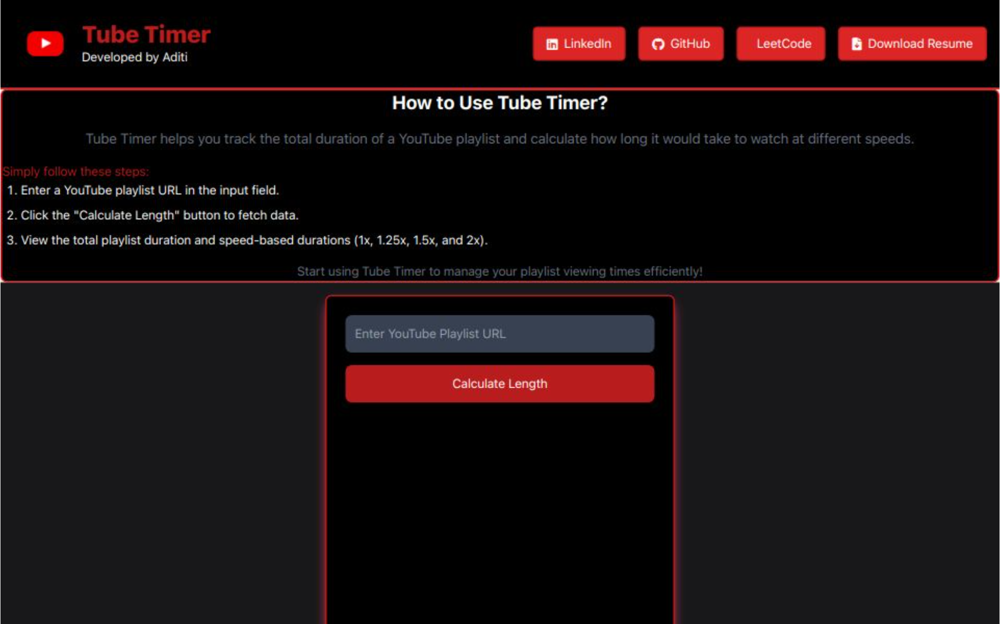

# Tube-Timer

Tube-Timer is a simple web tool designed to calculate the total length of YouTube playlists, with the option to view durations at different playback speeds.

 <b>Click this icon to view Project<b>

---

## Tech Stack

- **Frontend**: React , Tailwind CSS
- **Backend**: Node.js, Express.js
- **APIs**: YouTube Data API

---

## Features
- Copy Playlist URL: Paste the URL of the YouTube playlist you want to analyze.

- Calculate Total Length: Instantly get the total duration of all videos in the playlist.

- Duration for Different Speeds: View the adjusted playlist length for various playback speeds (e.g., 1.25x, 1.5x, 2x).

Enjoy using Tube-Timer to efficiently manage your YouTube playlists and optimize your viewing experience!
